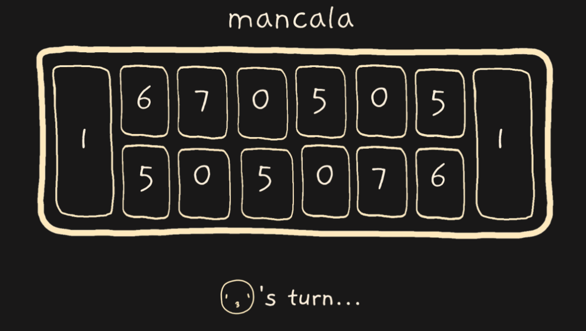
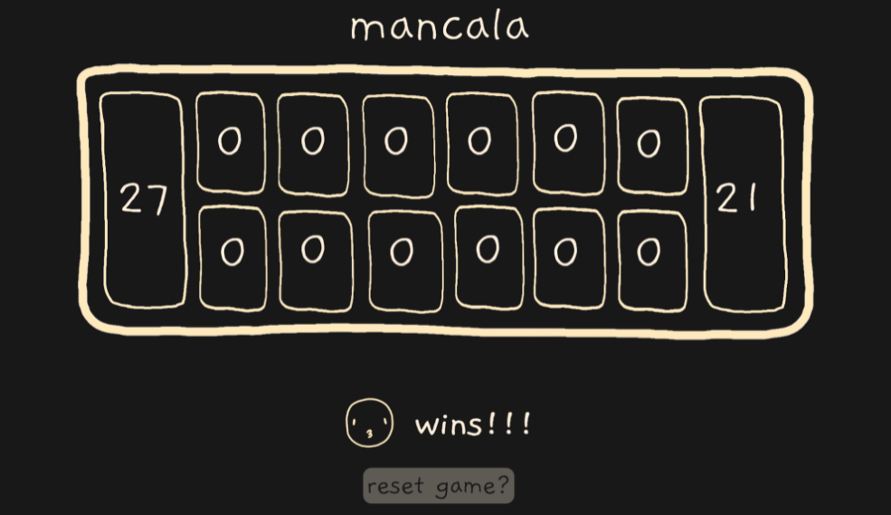

# Mancala

### Game Background:
According to The Spruce Crafts:

> Mancala is a game where players "sow" and "capture" seeds. Historians believe that mancala may have originated with the dawn of civilization as a record-keeping technique, a harvesting ritual, or a divination tool. There's evidence that the game was played thousands of years ago in ancient Sumeria (modern-day Iraq), in ancient Sudan on the upper Nile River, and Egypt. Ancient mancala game boards have been unearthed in Zimbabwe, Uganda, and Ghana. Mancala made its way to the United States when enslaved Africans brought over the game.
> 
>[Source](https://www.thesprucecrafts.com/how-to-play-mancala-409424)

For game rules please see [this PDF](https://endlessgames.com/wp-content/uploads/Mancala_Instructions.pdf)

### Screenshots:

#### Game mid match:

#### Game win:

### Technologies Used:
- JavaScript
- HTML
- CSS

### Getting Started:
1. Navigate to the game using [this link.](https://hicass.github.io/mancala/) 
1. Players 1 and 2 are already set up. The game starts with Player 1's turn.
1. A turn is taken when any of the glowing pits on that Player's side is clicked. After a turn is taken the game switches to the next Player.
1. The game alternates turns until the Winner is selected.
1. The game can be replayed by clicking the 'reset game' button that appears at the end of the match.
1. To reset the game mid-match refresh the page.

### Next Steps:
- Implement sound effects for various game events, such as a pit being clicked, or a winner being chosen.
- Replace the pit numbers with images of the pebbles. And add a pebble count preview that pops up when pits are being hovered over.
- Make view compatible with smaller screen sizes.
- Look for opportunities to refractor code to make it more DRY, readable, and more efficient.
